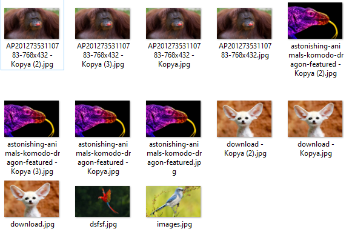
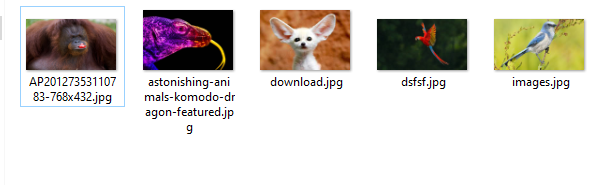

# Duplicate Files Deleter

Finds and deletes duplicate files by looking at the sizes. (Especially for photo galleries)
It doesn't look at the file type, it just looks at the size.

Change directory

		path = r'Test'

## Before

## After

