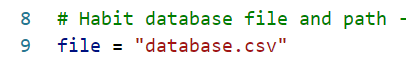

# Habit Tracker
Simple code to follow your habit. We can add/delete habit , add/delete activity , export (html,png) and see statistics

It’s a simple code for tracking a habit. You may add or delete a habit and or activity. Data can be exported as html or png file. It’s also possible to check the statistics.

    pip install tabulate (0.8.7)
    pip install pandas (1.2.0)
    pip install matplotlib (3.3.3)
        os,sys,time,datetime

# Setup
If there’s no database the setup function will start.

It's created a database for the habits.

The menu screen appears. (If the database was created before, the menu screen will be show up directly.)

# 1) Add Habit
You can add a habit

# 2) Delete Habit
You can delete a habit

# 3) Habit List

# 4) Add Activity
Adds daily activity. It can only be added once a day.

# 5) Delete Activity

### 1) Delete Last Activity

### 2) Search and Delete Activity

# 6) See & Save Activities
You can check the activities and save them as a html output. 

### 1) See a Specific Date

### 2) Specific Date Range
Shows the activities between two different date.

### 3) Last 10 Activities

### 4) Export to html (All data)
Saves all the data as a html file.

File:

# 7) Statistics

### 1) See in Terminal

### 2) Save .png file

# General
* checking user input
* limit daily activity entry
* check of dates
* control of habits and prevent errors in entry

