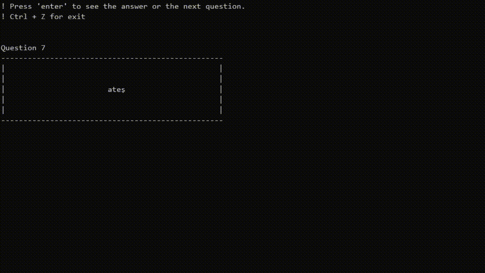

# Simple, word memorization game

File name and path
```python
file_name = 'file.txt'
```
ISO Country Codes
```python
translate_to = 'en'
translate_from = 'tr' #-> If it is empty, it detects automatically. ( translate_from = " '' )
```

#### Required Modules
*os, sys, random, textblob*

TextBlob: Simplified Text Processing

[https://textblob.readthedocs.io/en/dev/](https://textblob.readthedocs.io/en/dev/)
[https://github.com/sloria/TextBlob](https://github.com/sloria/TextBlob)

    pip3 install textblob



